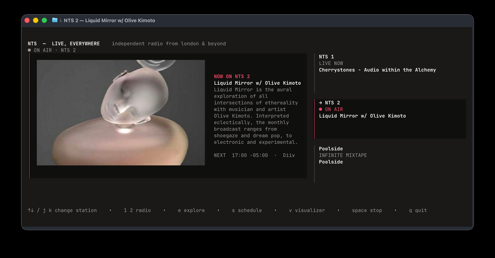

# nts

### NTS Radio, in your terminal.

<p align="center">
  
</p>

`nts` is an unofficial NTS Radio player for the terminal, written in Rust.
Listen live, move between stations without interrupting playback, see what is
on now and next in your local time, and disappear into the Infinite Mixtapes.

It starts with NTS 1. The rest is yours to find.

## Install

```sh
brew install r-ohan/nts/nts
```

Or add the tap once, then use the short name:

```sh
brew tap r-ohan/nts
brew trust r-ohan/nts
brew install nts
```

`mpv` is installed automatically by Homebrew. To build from source, install
Rust 1.85+ and `mpv`, then run:

```sh
cargo install --git https://github.com/r-ohan/nts-radio-cli.git
```

## Inside

- NTS 1, NTS 2, and eight Infinite Mixtapes.
- Live show details, next-up information, and schedules in your local time.
- Artwork in image-capable terminals; a clean text-first experience everywhere else.
- A layout that adapts from a small terminal to a full-screen listening room.
- macOS Now Playing and media-key support.
- One hidden visualizer, for when the room needs to get a little stranger.

## Keys

| Key | Action |
| --- | --- |
| `space` / `enter` | listen or stop; choose a station in Explore |
| `↑↓` / `j k` | change station or browse Explore |
| `1` / `2` | jump to NTS 1 or NTS 2 |
| `e` | open or close Explore |
| `s` | open or close the live schedule |
| `v` | open or close the visualizer |
| `esc` | close the current overlay; quit from the main view |
| `q` | quit |

## Notes

Artwork appears in terminals with Kitty, iTerm2, or Sixel image support—such
as Ghostty, iTerm2, Kitty, and WezTerm. It is intentionally omitted in
text-only terminals rather than turned into an ugly raster.

NTS publishes the direct live streams and public schedule metadata used by the
app. See NTS’s [listening guide](https://ntslive.freshdesk.com/support/solutions/articles/77000587257-tunein).

`nts` is independent and unofficial. NTS is a trademark of NTS and this
project is not affiliated with or endorsed by NTS.

## Development

```sh
cargo test
cargo clippy -- -D warnings
cargo run --release
```

## License

[MIT](LICENSE)
